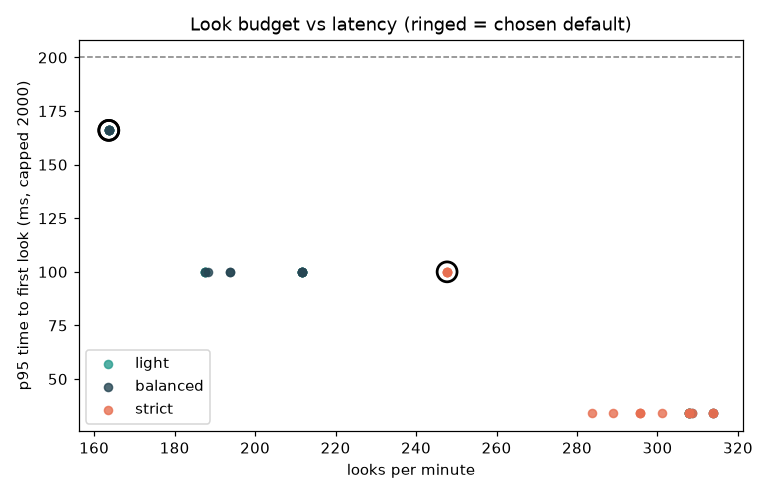

# Chapter 2: Motion

## Look budget (Phase 2.2)

Tuned on synthetic dev sessions: synth-dev-1, synth-dev-2. Real dev recordings: PENDING-HUMAN (HC-2.2).

| mode | tile_level | min gap ms | looks/min | % frames analysed | % within 200 ms | p95 ms | cut recall % | false cuts/min |
|---|---|---|---|---|---|---|---|---|
| light | 8 | 250 | 163.6 | 9.1 | 98.2 | 166 | 100 | 0.00 |
| balanced | 8 | 250 | 163.6 | 9.1 | 98.2 | 166 | 100 | 0.00 |
| strict | 8 | 250 | 247.7 | 13.8 | 100.0 | 100 | 100 | 0.00 |

Per situation (% frames analysed, chosen params):

| mode | feedScroll | reels | video | static | other |
|---|---|---|---|---|---|
| light | 10.7 | 11.4 | 6.7 | 13.2 | 2.0 |
| balanced | 10.7 | 11.4 | 6.7 | 13.2 | 2.0 |
| strict | 18.2 | 15.9 | 6.7 | 13.2 | 2.0 |

Scene cuts (Balanced): recall 100%, false cuts 0.00/min (AC-2.2-02).

